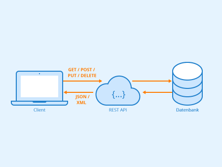

# API_LPD2023
## Script zu meinem Vortrag Linux Presentationday 2023-1
Angelegt Donnerstag 25 Mai 2023
**Stefan Höhn   Wormser Linux User Stammtisch  Wolust**

Mir gehts mehr um die Möglichkeiten als um eine korrekte Definition.
Folien ? Internet an persönliche Anforderungen anpassen. Hacken so wie ich das möchte.
Beispiele:  Schwerpunkt Worms , Medien , Grafik

APIs und Bash-Kommandozeile
===========================
Keine Angst . Ich erkläre das Stück für Stück

Was ist Bash? Unterschied zu Fensterprogrammen.
-----------------------------------------------
### Bash: 🤗️
Bourne again Shell
Mensch-Maschine Schnittstelle . Human Machine Interface“ (HMI)
Befehl an Maschine-> Ausgabe  (auch Computerprogramm)
Das braucht  man  für BASH:
Kleines schwarzes Kästchen -> Dosfenster -> Termialemulator -> Terminal
Es gibt verschiedene Shells : zsh, csh, fish ………Powershell ?
Hier  gehts um BASH

### Unterschied zum Fensterprogramm
Viele Newbies halten das für Nachteil :
Mausanwendungen sind sehr eingeschänkt 🐭️❌️
**Vorteil** : Ich mach mir meine (Welt) Ausgabe  wie sie mir gefällt, mit wenigen Befehlen. 🌍️
ls, cd, cat ,nano, man …

Pipes und Grep. sehr einfach
----------------------------

Man kann mit Pipes die Ergebnise von Programme weiterleiten in ein anderes Program   Das Zeichen | (AltGr <>>|)
🔗️ Beispiel  für Pipes:  ls| cat
✂️ Beispiel für grep : ls| grep  *.txt

Was ist API?  Wo findet man API, was macht man damit.
-----------------------------------------------------
Application Programming Interface
Fast alle Programme und auch  viele Webseiten haben API , irgend wie mit  Json,rss,csv,xml …
Beispiel : Wetterseite der Hochschule Worms
API Endpoint ist (kann) eine spezielle URL sein. (https:// ……) 

**Liefert Daten, die man filtern und anzeigen kann.**

Unterschiede zum Webbrowser. Und was ist curl ?
-----------------------------------------------
**Webbrowser** kann Daten im HTML-Format anzeigen
**Curl** zeigt HTML Source und allgemein Text aller Art an.

<.............. Ende Vorgeplänkel .................>

Beispiel: Wetter von der Hochschule Worms
-----------------------------------------
**frei und ohne Token**
<https://wetter.hs-worms.de/>
**Ausgabe in Json**  kann man greppen ✂️oder besseres Tool ist **jq**  ✂️
<---
u=$(curl -k <https://wetter.hs-worms.de/api/v3/data>)
temperatur=$(echo $u|jq ".temperature.out")
echo $temperatur
---->
**geht noch einfacher: 😀️**
curl -s <https://wetter.hs-worms.de/api/v3/data> | jq '.temperature.out'
  
Schön aber was mach ich jetzt mit dem  Output ?
Kreativ sein !
Beispiele:
Bei 🐘️**Mastodon** oder 🐦️Twitter oder auf andere Webseite **hochladen mit Token** über denen ihre  API  hochladen  (Get,Post) 
oder **Temperaturwarnung**  Frost, Regen, … ☀️☔️🥶️
Popups bei Störungen  Server, Maschinen, IOT

**Code** Beispiel für einfache Temperaturwarnung 🌡️
``t=$(curl -s`` [``https://wetter.hs-worms.de/api/v3/data``](https://wetter.hs-worms.de/api/v3/data) ``| jq '.temperature.out')``
``# 15.8  nach 15,8  (weil deutsch)`` 
``t=${t//./,}``
``t1=17``
``if (($t<$t1));then``
   ``echo "Uh, das ist kalt !"``
``else``
  ``echo "Ganz schön warm !"``
``fi``

**Experimental  bei Twitter hochladen**  (vielleicht ist dieses Perlscript jetzt auch schon gesperrt)
nur **mit Token** sehr eingeschränkt

ssh smarpt.de [/home/karl/bin/wetter1.sh](file:///home/karl/bin/wetter1.sh)
<https://twitter.com/Wolug>

🐦️Twitter-Api früher gerne genutzt API V1 + V2
😒️ttytter und 😒️twurl ist kaputt.  Direkt über curl mit V2 ???

Mehr Beispiele: Wettervorhersage DWD, Audio mit KDE , Mastodon und andere (yt-dlp)
----------------------------------------------------------------------------------

### Wettervorhersage API
Es gibt spezielle Programme die einem die umständliche Eingebe über **curl** abnehmen.
zB. **Wetterdienst**  (10 Tage Vorhersage) fragt die Wettervorhersage beim **DWD ist frei und ohne Token**

K2635 ist der Container  Worms Hagenstrasse

*****
cd bin/wetter

*****
gnuplot wetter1.gp

*****
Jetzt wirds bunt  APi liefert Daten für ein **Diagramm  📈️**

gwenview wetter1.png

*****

Regenradar-API  vom DWD (Auswerung mit Python QGIS)

### Luftqualität Worms
(für Fortgeschrittene Bash User)
readarray -td ";" lq <<< $(curl "<https://www.umweltbundesamt.de/api/air_data/v3/airquality/csv?date_from=$(date> -d 'yesterday' +%F)&time_from=24&date_to=$(date +%F)&time_to=24&station=1460&lang=de" |grep -E x\|$(date -d '1 hours ago' +%H))
echo ${lq[1]}:${lq[7]};echo ${lq[2]}:${lq[8]};echo ${lq[3]}:${lq[9]};echo ${lq[4]}:${lq[10]};echo ${lq[5]}:${lq[11]};echo ${lq[6]}:${lq[12]}
**Kommt sowas raus :**
Datum:"'26.05.2023 04:00'"
"Feinstaub (PM₁₀) stündlich gleitendes Tagesmittel in µg/m³":15
"Ozon (O₃) Ein-Stunden-Mittelwert in µg/m³":58
"Stickstoffdioxid (NO₂) Ein-Stunden-Mittelwert in µg/m³":15
"Feinstaub (PM₂,₅) stündlich gleitendes Tagesmittel in µg/m³":9
Luftqualitätsindex DERP023:"sehr gut"

### Audio API mit KDE  (Windowmanager für Linux)
Audio API von KDE  wird benutzt zum Abfragen.
Mein Bashscript unterstützt Mediaplayer VLC, Webbrowser Chromium/Firefox , Elisa, Clementine
**QDBusViewer hilft** bei der Suche nach Parametern 
qdbus org.mpris.MediaPlayer2 …
Sourcrcode:
nano /home/karl/bin/twitter-pic/toot_music 
bis zum Ende Scrollen und  Matodon-API zeigen.   API-App heißt toot
Action:
Link auf dem Desktop klicken !

### Mastodon  API  für die Bash

Ich empfehle toot 🐘️
toot timeline (Pseudo grafisch)
toot  post  test
**Beispiel zéitverzögert**
read -i "Stunden " later ; (sleep $later"h"  && toot post "$later Stunden später")&
Egebnis angucken
<https://social.tchncs.de/@dewomser>

### Sonderfall RSS
Beispiel Nibelungenkurier 😀️
[/home/karl/bin/rss-test/rss1.sh](file:///home/karl/bin/rss-test/rss1.sh)
Worms.de 😀️
Wormser Zeitung 😀️

### Sonderfall Serielle Schnittstelle / USB
echo "payload" >/dev/tty3
cat [/dev/tty3](file:///dev/tty3)

### Sonderfall Linux Kernel API
Hier zu kompliziert

Fertig !

*****

Und  zum Schluss noch Thema (ca. 5 Minuten) : Wolust / Webseite / Wer sich interessiert soll kommen.
----------------------------------------------------------------------------------------------------

Ich probiere mich diesmal kürzer zu fassen als beim letzten Mal.

Was war  2022/2023 ?
Wir sind gewachsen 11 Tuxe beim letzten Stammtisch im Mai
Wir brauchen einen Raum , VHS 
Homepage Probleme  Jekyll bei Github.  ich habs repariert  Ruby 2 Gems  ersetzt
Alle die heute hier sind  … 1, Dienstag im Monat. Weitersagen
Default-Treffpunkti st Timescafe
Immer bei Wolust.de gucken !
Oder auf unsem Matrix Channel

………………………………………………………………

### Quellen :
<https://github.com/dewomser>
<https://gist.github.com/dewomser>
Grafik API (CC): <https://www.seobility.net/de/wiki/REST-API>

